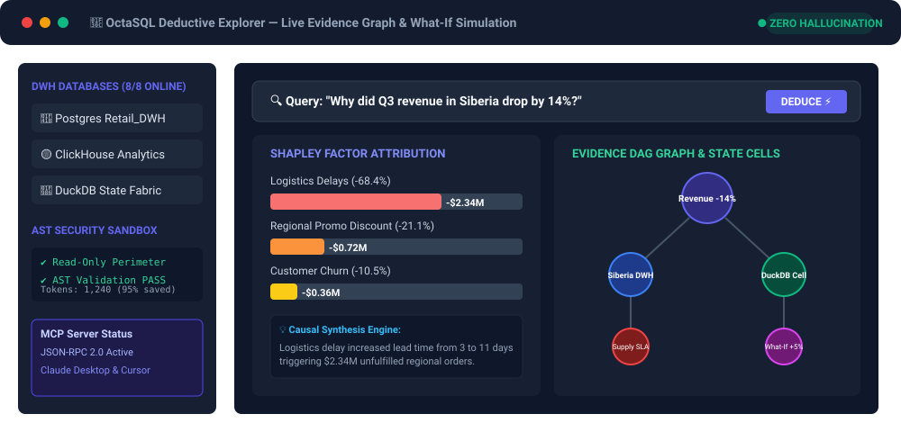
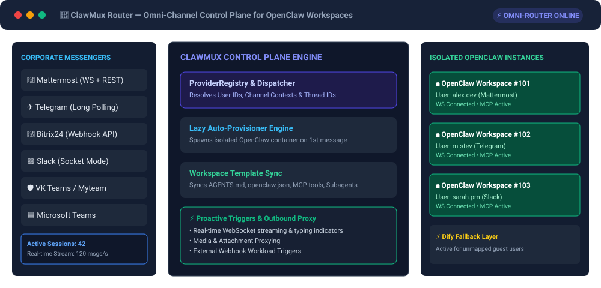

<div align="center">

### Data Engineer • *AI* Data Platform Architect • Open-Source Creator

[](https://github.com/MartyStev)
[](https://martystev.github.io/octasql-landing/)
[](https://tg.stigione.netcraze.link)

<p align="center">
  <b>Architecting enterprise data pipelines, robust DWHs, and *AI*-native data infrastructure.</b>
</p>

</div>

---

## 🚀 About Me

I am a **Data Engineer & *AI* Data Platform Architect** specializing in building reliable enterprise data warehouses (**Google BigQuery**, **ClickHouse**, **PostgreSQL**, **SAP HANA**), production ETL/ELT pipelines orchestrated with **Apache Airflow**, algorithmic scoring engines (Lead Heat Scoring), and **AI**-native data tooling. 

My work bridges traditional data engineering with modern *AI* agent ecosystems — building zero-hallucination *AI* analytics runtimes, Model Context Protocol (*MCP*) integrations, and *AI*-driven automation workflows.

* 🔭 **Currently building:** [OctaSQL](https://github.com/MartyStev/octasql-landing), [ClawMux](https://github.com/MartyStev/ClawMux) &amp; [pg_mcp_qauth](https://github.com/MartyStev/pg_mcp_qauth)
* ⚡ **Core focus:** Enterprise DWH Architecture, Apache Airflow DAG Factories, *AI*-Native Data Platforms, Causal &amp; Shapley Factor Attribution, Model Context Protocol (*MCP*)
* 💬 **Ask me about:** BigQuery &amp; ClickHouse Data Pipelines, Airflow Orchestration, *AI* Text-to-SQL without hallucinations, Omni-Channel *AI* Messaging Integration

---

## 🌌 Featured Projects

<table width="100%">
  <tr>
    <td width="50%" valign="top">
      <h3 align="center">🌌 OctaSQL Engine</h3>
      <p align="center"><i>Deterministic Deductive Analytics Engine for Enterprise DWH</i></p>
      <p>A next-generation enterprise platform that completely eliminates *AI* Text-to-SQL hallucinations by isolating reasoning in a closed mathematical perimeter.</p>
      <ul>
        <li><b>Zero-Hallucination *AI*:</b> AST Security Sandbox &amp; 100% Read-Only execution.</li>
        <li><b>Causal Engine™:</b> Shapley Factor Attribution for root-cause analysis.</li>
        <li><b>Enterprise DWH Support:</b> BigQuery, ClickHouse, Postgres, MS SQL Server, etc.</li>
        <li><b>*MCP* Native:</b> Ready for Claude Desktop &amp; Cursor IDE.</li>
      </ul>
      <p align="center">
        <a href="https://github.com/MartyStev/octasql-landing"><b>View OctaSQL Repository →</b></a>
      </p>
    </td>
    <td width="50%" valign="top">
      <h3 align="center">🤖 ClawMux</h3>
      <p align="center"><i>Omni-Channel *AI* Router &amp; Control Plane for OpenClaw</i></p>
      <p>A lightweight multi-user control plane and omni-channel *AI* router that dispatches corporate chat traffic to per-user isolated OpenClaw instances over persistent WebSockets.</p>
      <ul>
        <li><b>Omni-Channel *AI* Routing:</b> Mattermost, Telegram, Bitrix24, Slack, VK Teams, MS Teams.</li>
        <li><b>Lazy Auto-Provisioning:</b> Dynamic lifecycle management for OpenClaw *AI* workspaces.</li>
        <li><b>Template Sync:</b> Syncs AGENTS.md, openclaw.json, subagents, and *MCP* tools.</li>
        <li><b>Real-Time Streaming:</b> Streaming, typing indicators, file proxying &amp; proactive triggers.</li>
      </ul>
      <p align="center">
        <a href="https://github.com/MartyStev/ClawMux"><b>View ClawMux Repository →</b></a>
      </p>
    </td>
  </tr>
  <tr>
    <td width="100%" colspan="2" valign="top">
      <h3 align="center">🔐 pg_mcp_qauth</h3>
      <p align="center"><i>OAuth 2.1-Secured Postgres MCP Server with Role &amp; Row-Level Isolation</i></p>
      <p>A Model Context Protocol resource server that lets *AI* agents (Claude Code, VS Code) query PostgreSQL safely: JWTs from your own Keycloak/Authentik broker Google, Microsoft, GitHub and AD logins, while access is enforced by real Postgres mechanics.</p>
      <ul>
        <li><b>OAuth 2.1 Resource Server:</b> RFC 9728 discovery, JWKS validation, pinned audience &amp; asymmetric algorithm (anti token-passthrough).</li>
        <li><b>Three-Tier Access:</b> schema/table via <code>GRANT</code>s under <code>SET LOCAL ROLE</code>, rows via RLS session variables.</li>
        <li><b>AST SQL Guard:</b> <code>sqlglot</code>-parsed read-only enforcement with round-trip token integrity.</li>
        <li><b>Verified E2E:</b> browser PKCE sign-in flows against a real Keycloak 26; CI matrix on Python 3.11–3.13.</li>
      </ul>
      <p align="center">
        <a href="https://github.com/MartyStev/pg_mcp_qauth"><b>View pg_mcp_qauth Repository →</b></a>
      </p>
    </td>
  </tr>
</table>

---

### 🖥️ OctaSQL Architecture &amp; Interactive UI

```
                      ┌─────────────────────────────────────────┐
                      │          User Business Query            │
                      │  "Why did revenue in Siberia drop 14%?" │
                      └────────────────────┬────────────────────┘
                                           │
                                           ▼
┌────────────────────────────────────────────────────────────────────────────────────────┐
│                                   OCTASQL CORE                                         │
│                                                                                        │
│  [ 1. Hybrid BM25 Index ] ──► [ 2. DuckDB State Fabric ] ──► [ 3. Deductive Planner ]   │
│         (Schemas + Synonyms)          (Local State Layer)          (Hypothesis Gen)    │
│                                                                          │             │
│                                                                          ▼             │
│  [ 6. Shapley Attribution ] ◄── [ 5. Exec in Engine ] ◄── [ 4. AST Security Sandbox ]  │
│      (Delta Decomposition)        (Postgres / ClickHouse)      (Read-Only Guarantees)  │
└──────────────────────────────────────────┬─────────────────────────────────────────────┘
                                           │
                                           ▼
                      ┌─────────────────────────────────────────┐
                      │    Deterministic Factor Report          │
                      │  • Logistics: -68.4% (-$2.34M)          │
                      │  • Discount:  -21.1% (-$0.72M)          │
                      └────────────────────┴────────────────────┘
```

#### 📊 OctaSQL Explorer Web UI Preview


> 💡 *Explore live evidence graphs, factor drill-downs, and counterfactual What-If scenarios in real time at [martystev.github.io/octasql-landing](https://martystev.github.io/octasql-landing/).*

---

### 🤖 ClawMux Omni-Channel Architecture &amp; Control Plane

```
Corporate Messengers (Mattermost, Telegram, Bitrix24, Slack, VK Teams, MS Teams)
      │
      ▼
  ClawMux Router (Multi-Channel Dispatcher)
      ├─ ProviderRegistry (Chat Adapters Layer)
      ├─ MappingStorage & Workspace Auto-Provisioner
      └─ Persistent WebSocket Connections & Task Triggers
      │
      ▼
Isolated Per-User OpenClaw Workspaces (Workspace #101, Workspace #102, ...)
```

#### ⚙️ ClawMux Multi-User Control Plane Preview


---

## 🛠️ Technical Stack &amp; Tools

```
Data Warehousing & DBs : Google BigQuery, ClickHouse, PostgreSQL, SAP HANA, Redis
Orchestration & ETL    : Apache Airflow (Declarative DAG Factories), Python, Pandas, SQL
AI & Data Platforms    : Model Context Protocol (MCP), AI Agent Architecture, Shapley Factor Attribution, AST SQL Parsing
Backend & APIs         : FastAPI, Django, AsyncIO, WebSockets, REST API, Webhooks
DevOps & Infrastructure: Docker, Docker Compose, GitHub Actions (CI/CD), Linux, NGINX, VPN / Proxy
```

<p align="center">
  
  
  
  
  
  
  
</p>

---

## 📬 Connect with Me

* 💬 **Telegram:** [tg.stigione.netcraze.link](https://tg.stigione.netcraze.link)
* 🌐 **OctaSQL Landing Page:** [martystev.github.io/octasql-landing](https://martystev.github.io/octasql-landing/)
* 🐙 **GitHub Profile:** [github.com/MartyStev](https://github.com/MartyStev)

<div align="center">
  <sub>© 2026 MartyStev. Building high-impact open-source data &amp; *AI* tools.</sub>
</div>
